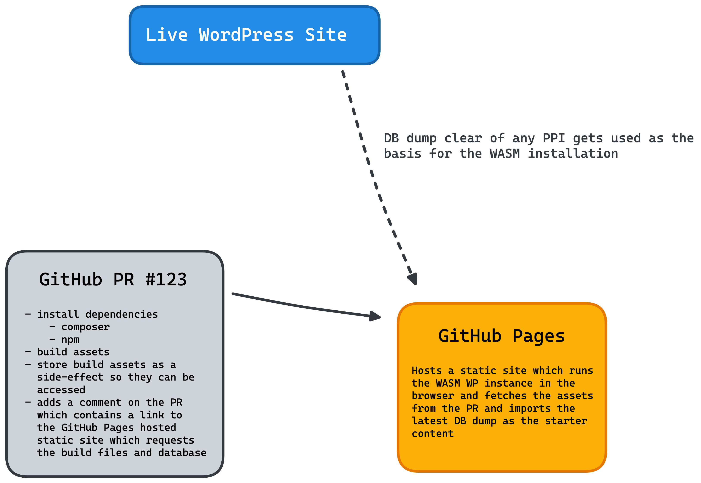

# Instant Deployment Previews for WordPress

> **Warning**
> This is an early exploration of this topic and may as wel not go anywhere.

## High-level Idea

The idea is to create a GitHub Action which can be used in any WordPress project with code managed in GitHub. This action would take a build WordPress Theme / Plugin / wp-content folder and store it as a CI artifact.

At the same time, it would deploy an instance of the [WordPress Playground](https://github.com/WordPress/wordpress-playground) to GitHub pages. This GitHub Pages static site would then be able to read the build artifacts and spin up a live preview of the deployment with that code activated right in the browser.

## Features

- [x] Run WordPress Playground on a GitHub Pages hosted static page
- [x] Add a comment to any opened PR containing a link to the GitHub Pages site
- [x] Updates said comment every time a new commit gets added to the PR
- [ ] Pass a param with the relevant build information to the GitHub Pages hosted site
- [ ] WordPress Playground uses CI Build artifacts as the basis for its filesystem

### Maybe in the future

- [ ] Some kind of way to pull a Database dump from the live site without any personal identifiable information in as the initial DB of the demo site
- [ ] Some way to allow PR creators to build out demo content showcasing new elements on the page / linking directly to a page on the WASM site that showcases those changes
